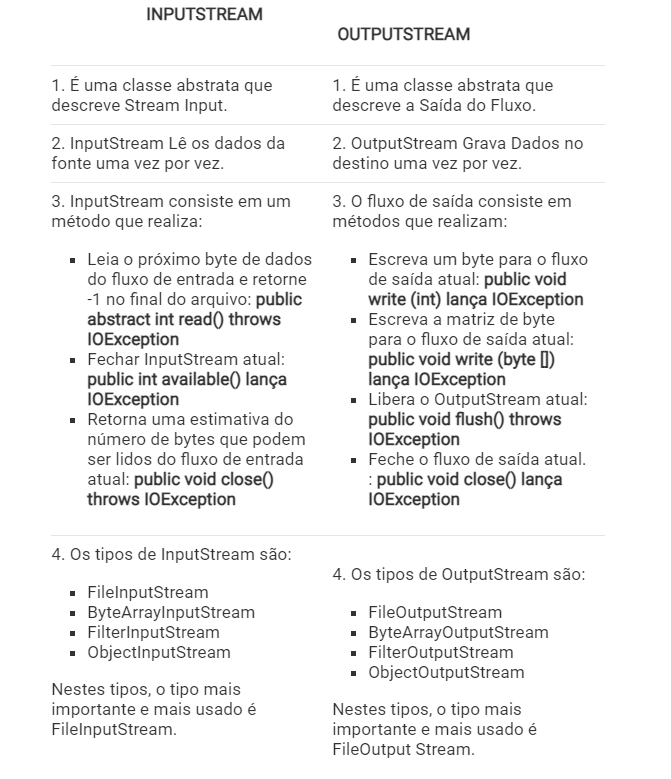

# DIFERENÇA ENTRE INPUTSTREAM E OUTPUTSTREAM EM JAVA

Um fluxo pode ser definido como a sequência de dados ou fluxo contínuo de dados. Streams são uma maneira clara de lidar
com entrada / saída. Os fluxos são de dois tipos, conforme descrito abaixo:

No diagrama acima, nosso InputStream e OutputStream residirão no fluxo de bytes. Então, vamos discutir o fluxo de bytes.

- 1.1InputStream: InputStream é uma classe abstrata de Byte Stream que descreve a entrada de fluxo e é usada para leitura 
e pode ser um arquivo, imagem, áudio, vídeo, página da web, etc. não importa. Assim, InputStream lê os dados da fonte, 
um item por vez.
- 

- 1.2 1.2 OutputStream: OutputStream é uma classe abstrata de Byte Stream que descreve a saída do stream e é usada para 
gravar dados em um arquivo, imagem, áudio, etc. Assim, OutputStream grava os dados no destino, um de cada vez.

##  Diferença entre InputStream e OutputStream

## Classe Java PrintStream

A PrintStreamclasse do java.io pacote pode ser usada para gravar dados de saída em formato legível (texto) em vez de bytes.

Ele estende a classe abstrata OutputStream.

Ao contrário de outros fluxos de saída, o PrintStreamconverte os dados primitivos (inteiro, caractere) no formato de 
texto em vez de bytes. Em seguida, ele grava os dados formatados no fluxo de saída.

E também, a PrintStreamclasse não lança nenhuma exceção de entrada/saída. Em vez disso, precisamos usar o 
checkError()método para encontrar qualquer erro nele.

Nota : A PrintStreamclasse também possui um recurso de descarga automática. Isso significa que força o fluxo de saída a 
gravar todos os dados no destino sob uma das seguintes condições:

se o caractere de nova linha \nfor escrito no fluxo de impressão
se o println()método for invocado
se uma matriz de bytes for escrita no fluxo de impressão

## Criar um PrintStream

Para criar um PrintStream, devemos importar o java.io. PrintStreampacote primeiro. Depois de importar o pacote, 
aqui é como podemos criar o fluxo de impressão.
1. Usando outros fluxos de saída

// Creates a FileOutputStream-Para escrever valores primitivos em um arquivo, usamos a classe FileOutputStream.
FileOutputStream file = new FileOutputStream(String file);

// Creates a PrintStream
PrintStream output = new PrintStream(file, autoFlush);

Aqui,

- criamos um fluxo de impressão que gravará dados formatados no arquivo representado porFileOutputStream
- aAutoFlushé um parâmetro booleano opcional que especifica se deve executar a limpeza automática ou não

2. Usando o nome do arquivo

// Creates a PrintStream
PrintStream output = new PrintStream(String file, boolean autoFlush);

Aqui,

- criamos um fluxo de impressão que gravará dados formatados no arquivo especificado
- AutoFlushé um parâmetro booleano opcional que especifica se deve executar autoflush ou não

Nota : Em ambos os casos, os PrintStreamdados gravados no arquivo usando alguma codificação de caracteres padrão. 
No entanto, também podemos especificar a codificação de caracteres ( UTF8 ou UTF16 ).

// Creates a PrintStream using some character encoding
PrintStream output = new PrintStream(String file, boolean autoFlush, Charset cs);
Aqui, usamos a Charsetclasse para especificar a codificação de caracteres.

- Métodos de PrintStream

A PrintStreamclasse fornece vários métodos que nos permitem imprimir dados na saída.

método print()
print()- imprime os dados especificados no fluxo de saída
println()- imprime os dados no fluxo de saída junto com um novo caractere de linha no final

## Referencias

- https://acervolima.com/diferenca-entre-inputstream-e-outputstream-em-java/
- https://acervolima.com/metodo-printstream-println-em-java-com-exemplos/
- https://www.programiz.com/java-programming/printstream <- importante ler
- https://dicasdejava.com.br/como-ler-arquivos-csv-em-java/
- 
